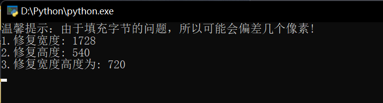

# FIX_BMP

**感谢8神的指导！**

**关于项目：**

- BMP默认从左下角开始绘制图像，当图像高度为负数的时候，则会从左上角开始绘制图像。
- 由于存在PaddingSize的问题，所以个别图像会出现几个像素的偏差范围，属于正常情况。

# 问题

**Q：为什么会存在填补？**

因为设计时适配存储簇的关系，BMP的每行会作4字节补齐。

---

**Q：如何计算填补呢？**

1. 这个比较简单，比如说图片位深度为24，那就是3个通道，也就是RGB的色彩空间（同等与一个像素占用3字节）。
2. 比如说现在有一张图片，宽度为3，高度为2，RGB色彩空间；3 * 3 = 9 (byte)，9 % 4 = 1，差3个字节才能4字节补齐。
3. 每行就会填补3个字节，高度为2，那就一共2行，会填补6字节。

# 效果

