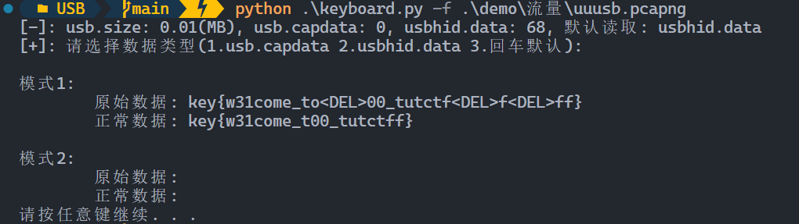
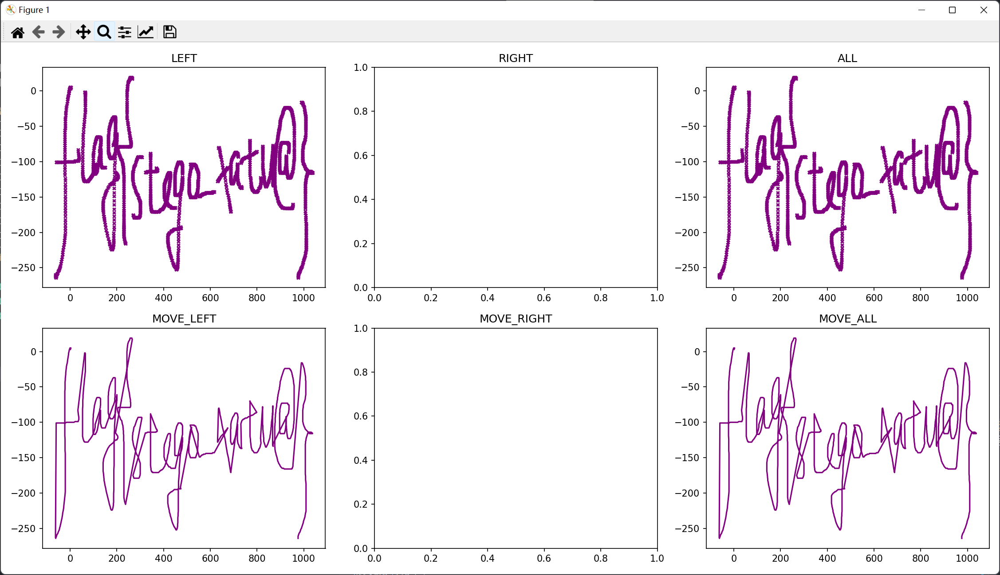
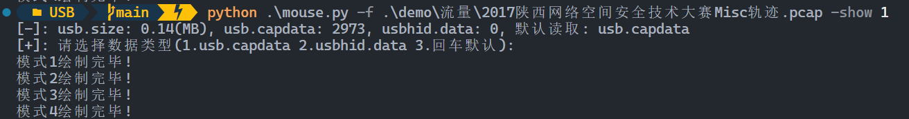
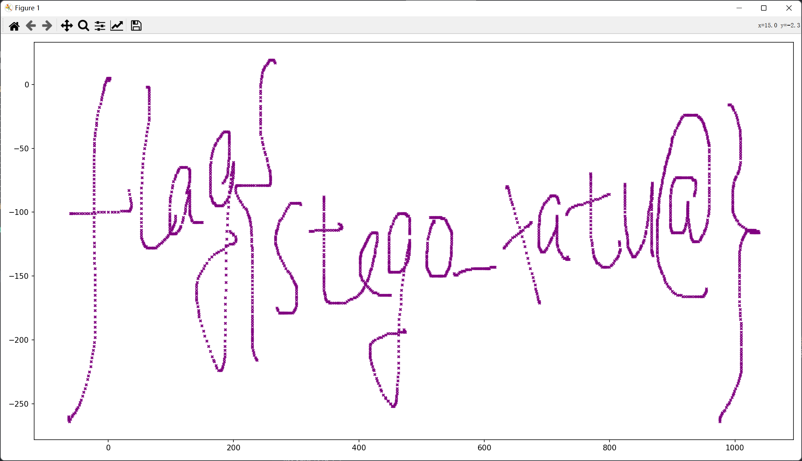
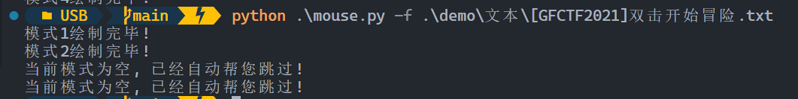

# USB

**关于项目：**

1. 首先你需要有安装wireshark（因为需要用到tshark提取流量内容）。
2. 当你参数传入的是流量包时候，尽量保证流量包名称没有空格和特殊符号等，避免出现找不到流量包的情况。

<br>

# Usage

## 键盘流量：

```
usage: keyboard.py [-h] -f F

optional arguments:
  -h, --help  show this help message and exit
  -f F        输入同级目录下的名称
```

## 鼠标流量：

```
usage: mouse.py [-h] -f F [-show SHOW]

optional arguments:
  -h, --help  show this help message and exit
  -f F        输入同级目录下的名称
  -show SHOW  单独显示某个(1.LEFT/MOVE_LEFT, 2.RIGHT/MOVE_RIGHT, 3.ALL/MOVE_ALL)
```

<br>

# 效果

## 键盘流量：

```
$ python .\keyboard.py -f .\demo\流量\uuusb.pcapng
```



<br>

## 鼠标流量：

### 1.正常模式

每个轨迹都绘制（共6张）



### 2.show参数

单独展示某一个轨迹



```
$ python .\mouse.py -f .\demo\流量\2017陕西网络空间安全技术大赛Misc轨迹.pcap -show 1
```



### 3.优点

自动跳过没有轨迹的模式！



